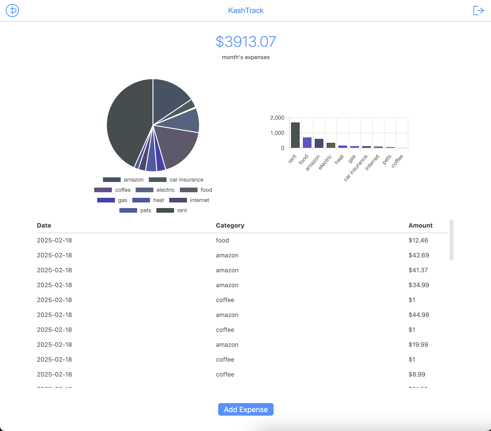

# Kash-Track

Where is all the kash going?

# Screenshots

# Server Setup Steps

- Create an EC2 instance

- Create a key pair

- Create a static IP

- Purchase a domain

- Map domain to static IP

- Install certbot on EC2 and generate SSL cert